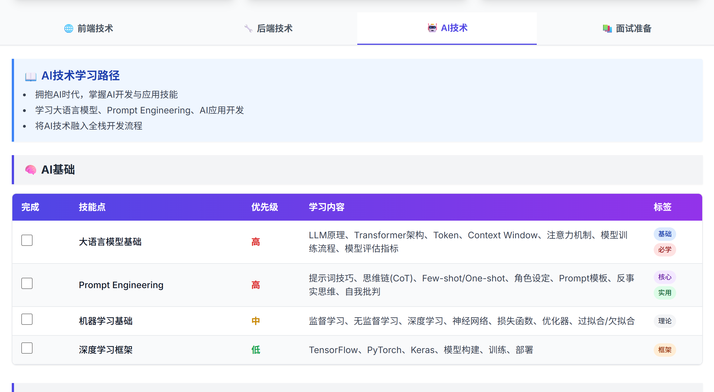

# 全栈开发工程师学习路线

一个用来记录和追踪全栈开发学习进度的todolist工具。

## 这是个啥

就是一个学习清单工具，把前端、后端、AI技术、面试准备这些学习内容都整理好了，你可以：

- 勾选已完成的任务
- 看到自己的学习进度
- 数据会保存在浏览器里，下次打开还在

## 效果展示



## 怎么用？

### 本地运行

```bash
# 安装依赖
npm install

# 启动开发服务器
npm run dev
```

然后打开浏览器访问 http://localhost:3000 就能看到了。

## 项目结构

```
src/
├── app/
│   ├── api/todos/route.ts    # 后端接口，提供todolist数据
│   ├── page.tsx              # 主页面
│   ├── layout.tsx            # 页面布局
│   └── not-found.tsx         # 404页面
├── components/
│   └── TodoTable.tsx         # 任务列表组件
└── data/
    └── todoData.js           # 所有学习任务数据
```

## 技术栈

- **前端框架**: Next.js 14 (App Router)
- **样式**: Tailwind CSS
- **语言**: TypeScript
- **数据存储**: localStorage (完成状态存在浏览器里)

## 功能特点

✅ 四大学习模块：前端技术、后端技术、AI技术、面试准备
✅ 任务优先级标注：高、中、低
✅ 丰富的标签分类
✅ 实时进度统计
✅ 数据本地持久化
✅ 响应式设计，手机电脑都能用

## 自己改数据

想修改学习内容？直接编辑 `src/data/todoData.js` 文件就行，数据结构很简单：

```javascript
{
  id: "唯一标识",
  title: "任务名称",
  priority: "high/medium/low",
  content: "详细说明",
  tags: ["标签1", "标签2"],
  completed: false
}
```

## 最后

这个工具就是帮你把学习计划可视化，知道自己学了啥、还差啥。加油学习！
